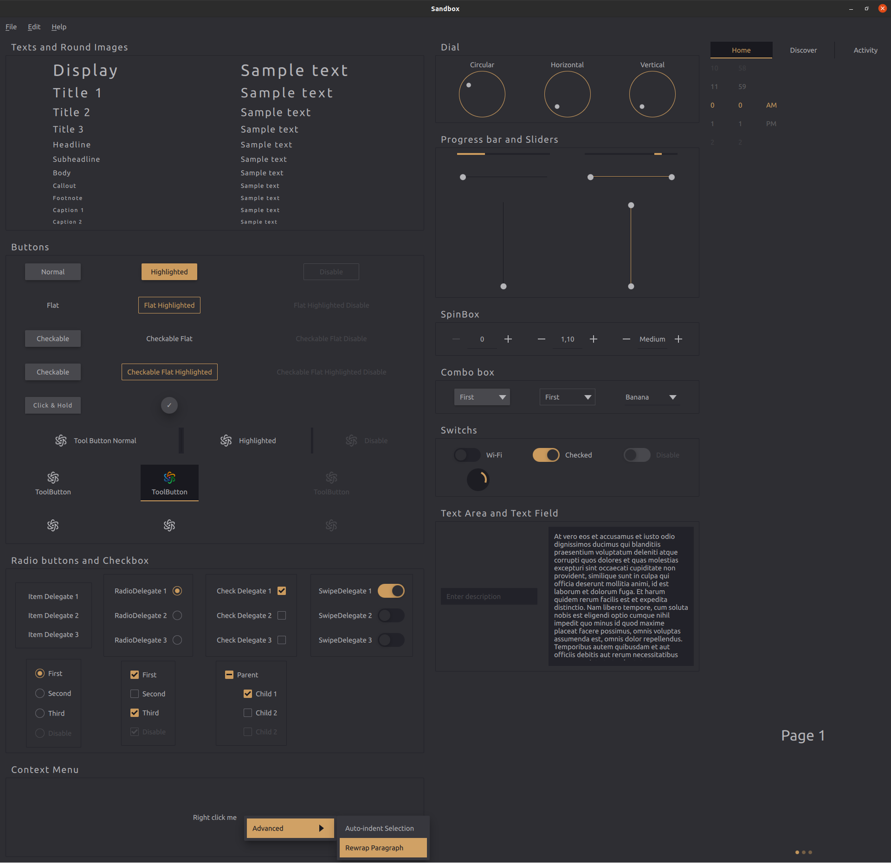

# Origin Style



## How to Build

``` shell
git clone http://gitlab.vmisecurity.com/spectrum/version-3/spectrum_style.git
mkdir build && cd build
cmake -S .. -G Ninja -DCMAKE_PREFIX_PATH=<Qt install path> -DCMAKE_BUILD_TYPE=Release 
ninja
```
